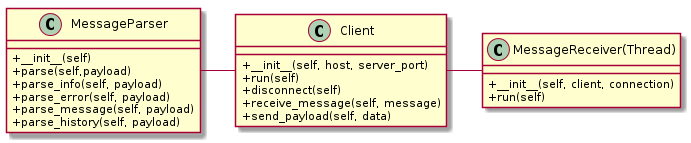
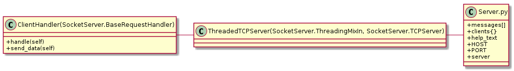

#Project TTM4100
## General description
We have introduced a new class called Server. It contains a dictionary with all
the clients and their chat history. This class is included in Clienthandler so
 that we can control if a username is available and retrieve the chat history of
 that specific client.
\\
The class diagrams shows the classes with their functions and variables. We have
 two sequence diagrams that shows a login sequence and a sequence of a message
 being sent out from a client to all the other clients connected to the server.
 A Clienthandler is set up for each client connected to the server via
 threading, so that all communication with the server is handled in parallel.
 The protocol used for sending information is JSON. The class MessageParser
 encryptes and decryptes the messages for the client, whereas the messaged on
 the server side are parsed and encrypted in the clienthandler.

##Class diagrams

### Client

### Server

## Sequence diagrams

### Log in

### Send message

